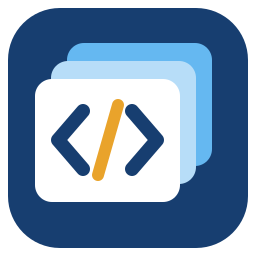

# ScriptDeck

更新日：2026-10-08



**ScriptDeck** は、HyperCardに着想を得たWindows向けのカード型アプリケーション作成ツールです。カードにボタン・入力欄・画像などを配置し、JavaScriptで動作を記述できます。

通常のアプリとして使う **Playerモード** と、カードを編集する **Magicモード** を備えています。DeckはUTF-8のJSONファイル（`.deck`）として保存します。

## 主な機能

- カードと部品の作成・編集、並べ替え、色の指定。
- Magicで作業領域全体を使うスクリプト編集画面。Tab入力・Ctrl+S保存に対応。
- Button、Field、Text、Image、Listbox、DropdownList、InputBox、Checkbox、RadioButton、TextEditor。
- アドレスバー付きのWindows標準ファイル・保存・フォルダ選択ダイアログ。
- JavaScriptから部品のプロパティ操作、動的な作成・削除、カード・Deckの移動。
- 外部画像と内蔵画像リソースの表示。
- ボタン、状態変更、カード表示、複数ファイルのドロップに対応するイベント。
- ファイル選択・保存ダイアログ、テキスト／バイナリーファイル操作。
- UTF-8のBOM付き／なしの読み書き、標準入出力、起動引数の取得。
- Beep・WAV再生、コンソール表示、ウィンドウの最前面制御。
- 環境変数、ファイルサイズ・日時、テキストのクリップボード。
- 外部プロセスの非同期起動、終了待ちと標準出力の取得。
- Playerでの1行スクリプト実行と、`.deck` のユーザー単位の関連付け。

## 動作環境とビルド

GUIはWindows x64向けです。描画にはDear ImGuiとDirect3D 11、JavaScriptにはQuickJS-NGを使用します。

1. Visual Studio 2026で「C++によるデスクトップ開発」とWindows SDKをインストールします。
2. このリポジトリの `ScriptDeck.slnx` を開きます。
3. **Release / x64** を選んでリビルドします。
4. `ScriptDeck/bin/x64/Release/ScriptDeck.exe` を実行します。

プロジェクトはVisual Studioのツールセット **v145** を指定しています。依存ライブラリのソースは同梱しているため、別途取得する必要はありません。日本語表示にはWindowsにインストール済みのMeiryoを使用します。

## フォルダ構成

- `ScriptDeck.slnx`：Visual Studioのソリューション。
- `ScriptDeck/`：ソース、プロジェクト、依存ライブラリ、画像、サンプル、テスト。
- `doc/`：APIなどの説明書。
- ルートの `README.md`、`LICENSE`、`THIRD_PARTY_NOTICES.md`：公開用の説明とライセンス通知。

## 起動方法

以下の例は `ScriptDeck/` をカレントディレクトリとして実行します。`ScriptDeck.exe` は実際のEXEのパス（例：`bin\x64\Release\ScriptDeck.exe`）に置き換えてください。

```bat
rem HomeをPlayerで開く
ScriptDeck.exe

rem 指定したDeckをPlayerで開く
ScriptDeck.exe sample.deck

rem Magicで編集する
ScriptDeck.exe -magic sample.deck

rem Deckにスクリプト用の引数を渡す
ScriptDeck.exe sample.deck "hello" "C:\work\input.txt"
```

Deck未指定時は `%LOCALAPPDATA%\ScriptDeck\home.deck` を開きます。ファイルがなければ、実行ファイルの内蔵リソースから初期Homeを作成します。初期Homeの「Open Deck」でDeckを選べます。「新規Deck」で未保存のDeckを作り、Magicへ切り替えます。既存Homeは自動更新しません。

Playerはカードと同じクライアントサイズの固定サイズウィンドウです。Magicではカード・部品・スクリプトを編集して保存できます。「実行プレビュー」で動作を確認し、「Playerモードへ」で通常のPlayerへ切り替えます。

Player終了時は未保存の変更を現在のDeckに自動保存します。保存失敗時は終了せず、内容を保持します。Magic終了時は従来どおり未保存の確認を表示します。

MagicからPlayerへ切り替えても、編集中の内容と未保存状態は保持します。未保存の編集がある場合、Magicのタイトルに `*` が付きます。

### Playerでスクリプトを直接実行する

**Ctrl + Space** で1行入力ウィンドウを開きます。例えば、以下を入力するとMagicに切り替わります。

```javascript
app.setMagic(true);
```

**Run / Enter** で入力ウィンドウを閉じてから実行し、**Close / Escape** で実行せずに閉じます。コードは実行中のDeckと同じJavaScript環境で評価されます。

### `.deck` の関連付け

実行ファイルを使用する場所に置いた後、Playerのスクリプト入力欄などから実行します。

```javascript
app.install();    // 関連付けとDeckアイコンを登録
app.uninstall();  // 自分の登録を解除
```

管理者権限を必要としないユーザー単位の登録です。EXEを移動した場合は新しい場所から再登録してください。Windowsで別アプリを既定にしている場合は、「プログラムから開く」でScriptDeckを選ぶ必要があります。

解除時は登録前の関連付けを復元し、他アプリが後から変更した設定は維持します。EXEやDeckファイルを削除する機能ではありません。

## JavaScriptの例

MagicでButtonとTextを配置し、Textの部品名を `message` に設定します。Buttonの部品スクリプトに次を記述してください。

```javascript
function mouseUp(event) {
    const message = app.currentCard.objectByName("message");
    message.text = "Hello, ScriptDeck!";
}
```

カードスクリプトは、そのカードが開かれたときに評価され、`openCard(event)` があれば呼び出されます。

```javascript
function openCard(event) {
    app.currentCard.objectByName("message").text = "カードを開きました";
}
```

DeckスクリプトはJavaScript実行環境の開始時に評価されます。共有関数や変数の定義に利用できます。部品・カードのスクリプトは、それぞれのイベント時に評価されます。

```javascript
const text = fs.readText("input.txt");       // UTF-8のBOMは自動判定
const data = JSON.parse(text);
fs.writeText("result.json", JSON.stringify(data, null, 2), true);
// 第3引数trueでUTF-8 BOM付き、falseまたは省略でBOMなし
```

相対パスは起動時のカレントディレクトリを基準にします。スクリプトはファイル操作などのホストAPIを利用できるため、信頼できるDeckを実行してください。

## カード・Deckの移動

```javascript
app.openDeck();                  // 未保存の変更を破棄して再読み込み
app.saveDeck();                  // 現在のDeckを上書き保存
app.saveAsDeck();                // 保存ダイアログを表示
app.nextCard();
app.prevCard();
app.topCard();
app.endCard();
app.goCardIndex(0);              // 0始まりの番号
app.goCard("card2");             // ID、またはカード名
app.goHome();                    // 現在のDeckを保存してHomeへ
app.changeDeck("other.deck", false); // 保存せずに別Deckへ
```

Deck移動の保存指定は省略時 `true` です。Deckの切り替えは実行中のスクリプト処理終了後に反映します。詳細は [NAVIGATION_API.md](doc/NAVIGATION_API.md) を参照してください。

## コマンドラインのDeck操作

GUIを開かず、Deckの情報取得・検証・コピーを行えます。

```bat
ScriptDeck.exe -run sample.deck info
ScriptDeck.exe -run sample.deck validate
ScriptDeck.exe -run sample.deck dump
ScriptDeck.exe -run sample.deck copy output.deck
```

`-run` はDeckのJSON操作用です。このモードでDeckのJavaScriptを実行する機能ではありません。

## ドキュメントとサンプル

最新の分類と詳細は [doc/readme.md](doc/readme.md) を参照してください。

| ファイル | 内容 |
| --- | --- |
| [USER_GUIDE.md](doc/USER_GUIDE.md) | Player／Magicの操作、スクリプト編集画面と雛形、TextEditorの操作、Ctrl+Spaceの1行実行、終了時の自動保存・未保存確認、Homeからの新規Deck作成、アイコンとDeckの関連付け。 |
| [SCRIPT_API.md](doc/SCRIPT_API.md) | Deck・カードスクリプトの実行タイミングとスコープ、`openCard`・`mouseUp`・`change`・`dropFiles`、Listbox／DropdownListの選択変更、文字列コードの実行。 |
| [OBJECT_API.md](doc/OBJECT_API.md) | カード・部品の検索、各プロパティの読み書き、リストの項目・選択状態、Checkbox／RadioButtonの状態・グループ、TextEditor、部品の動的作成・複製・削除・重なり順。 |
| [NAVIGATION_API.md](doc/NAVIGATION_API.md) | カード移動、Deck切り替えと保存指定、Home、新規Deck作成、`openDeck`・`saveDeck`・`saveAsDeck`、起動時に指定Deckが存在しない場合の動作。 |
| [APP_API.md](doc/APP_API.md) | 起動引数、JSON・ダイアログ表示、標準入出力、音声、Player／Magic・コンソール・ウィンドウ制御、Home・Deck・EXE・各フォルダのパス、クリップボード、環境変数、外部プロセスの非同期起動・終了待ちと標準出力取得。 |
| [FILE_API.md](doc/FILE_API.md) | UTF-8のBOM付き／なし、テキスト・バイナリーファイルの読み書き、ファイル・フォルダの列挙と操作、ファイル選択・保存・フォルダ選択ダイアログ、パス文字列とWindows／Unix形式の変換、ファイルサイズ・作成／更新／アクセス日時。 |
| [HISTORY.md](doc/HISTORY.md) | 過去の実装・変更・検証の記録。変更当時のファイル構成や仕様を含みます。現在の使い方・仕様は上記のカテゴリ別文書を参照してください。 |

`ScriptDeck/` に `sample.deck` をはじめ、`builtin-test.deck`、`object-test.deck`、`dynamic-test.deck`、`day2-test.deck` を同梱しています。

## 開発とテスト

CMake用の設定と、モデル・JavaScript・GUIのテストを含みます。

```sh
cmake -S ScriptDeck -B build -DBUILD_TESTING=ON
cmake --build build --config Release
ctest --test-dir build -C Release --output-on-failure
```

GUIはWindows専用です。非Windows環境ではモデル・JavaScript・ヘッドレスGUIテストとCLI部分をビルドできます。Windowsのファイルダイアログ、レジストリ関連付け、描画などの実機確認は別途必要です。

## ライセンス

ScriptDeck本体は **MIT License** で公開します。著作権表示は `Copyright (c) 2026 bryful` です。[LICENSE](LICENSE) を参照してください。

同梱する第三者コード・データは、それぞれのライセンスに従います。

| コンポーネント | ライセンス |
| --- | --- |
| Dear ImGui 1.91.9b | MIT |
| Dear ImGui同梱のstb、ProggyClean | MIT（stbはMITの選択肢を使用） |
| Dear ImGuiの日本語字形範囲の元データ | CC BY 4.0 |
| QuickJS-NG 0.16.2 | MIT |
| QuickJS-NG同梱のUnicodeデータ | Unicode License V3 |
| nlohmann/json 3.12.0 | MIT |

著作権表示とライセンス全文・帰属情報は [THIRD_PARTY_NOTICES.md](THIRD_PARTY_NOTICES.md) にまとめています。バイナリーを配布する場合も、`LICENSE` と `THIRD_PARTY_NOTICES.md` を同梱してください。
